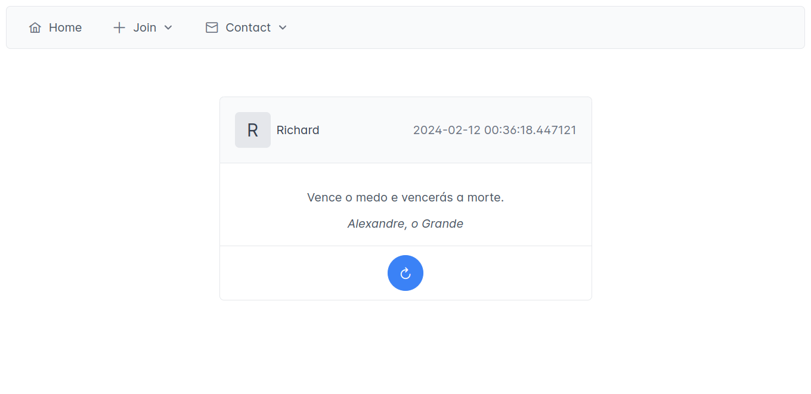
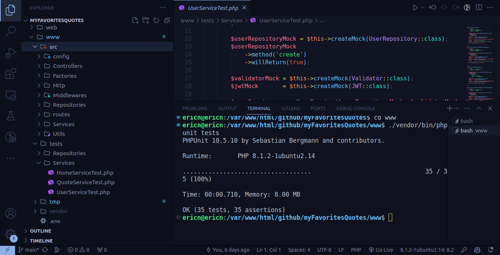

<h1 align="center">
  <br />
  
  <br />
  My Favorites Quotes
  <br />
</h1>

<h4 align="center">
  Aplicação Full Stack desenvolvida com PHP, PostgreSQL, Angular, PrimeNG, Docker e entre outros.
</h4> 

<p align="center">Data de criação: Feb 10, 2024</p>

<p align="center">
  
  
  
</p>




### Descrição

**"My Favorites Quotes"** é uma aplicação web projetada para permitir que os usuários armazenem e compartilhem suas citações favoritas de maneira conveniente.

No geral, a aplicação permite que os usuários **armazenem**, **explorem** e **compartilhem** suas citações favoritas.

Principais funcionalidades:
  * Cadastro
  * Autenticação
  * Gerenciamento de Citações
  * Geração de Citação Aleatória

### Features

Novos recursos foram adicionados no projeto, **principalmente no backend**, uma vez que fora introduzido o padrão de arquitetura em camadas, conhecido como **Layered Architecture**. Essa mudança proporciona uma estrutura mais organizada e modular para o backend da aplicação, permitindo a fácil implementação de testes unitários usando o **PHP Unit**.

A adoção do **Layered Architecture** promove uma melhor organização e separação de responsabilidades no código-fonte. Cada camada da arquitetura possui um conjunto específico de responsabilidades (**Dependency Injection**, **Controllers**, **Factories**, **Repositories**, **Services**, **Http**, **Middlewares**, **Utils** e entre outros).

* API
  * PHP-v8.2
    * Layered Architecture
    * Composer
    * PSR-1, PSR-4 e PSR-12
    * phpdoenv-v5.6
    * phpunit-v10.5
  * Apache
    * ModRewrite
  * PostgreSQL-v15.4
* UI
  * Angular-v17
    * Node-v21
    * NGINX
    * typescript-v5.3.2
    * rxJS
    * primeng-17.5.0
    * primeicons-v6.0.1
* DevOps
  * Docker
    * volumns
    * networks
  
### Execução

```sh

# Clone Repository
$ git clone https://github.com/EricNeves/myFavoritesQuotes.git

# Folder
$ cd myFavoritesQuotes/

# Install Dependencies - Angular
$ cd web && pnpm install

# Install Dependencies - PHP
$ cd www && composer update


```

Agora, na raiz do projeto **./myFavoritesQuotes** execute o comando abaixo:

```sh

# Execute Docker Command
$ docker-compose -f -d --build

```

O app está rodando nos seguintes processos:

* API: http://localhost:3333 
* WEB: http://localhost:3131 

### License 


### Author 🧑‍💻
<a href="https://www.instagram.com/ericneves_dev/"></a> <a href="https://linkedin.com/in/ericnevesrr"> </a>